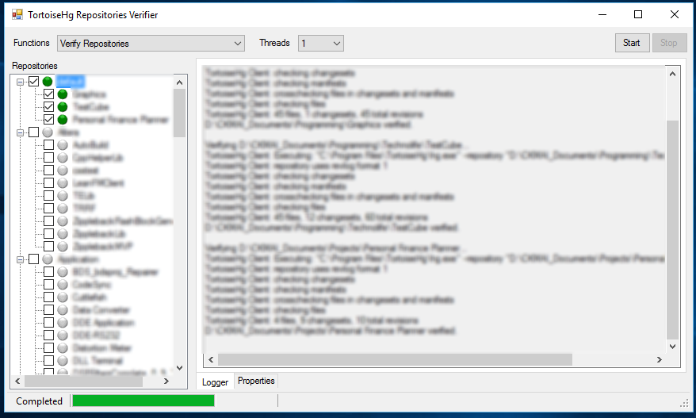

# TortoiseHgManager
A TortoiseHg (Mercurial SCM Based) repositories verification tool as helper tool on top of TortoiseHg.
This tool contains multiple functions which designed to work with multiple repositories, which included:
- Verify Repositories
- Fix Repositories
- Update Repositories
- Pull / Push Changes
- Check Uncommitted Changes.

More details explanation on CodeProject: [TortoiseHg Manager Repository Verification](https://www.codeproject.com/Tips/509059/TortoiseHg-Manager-Repository-Verification)

## System Requirement
- Microsoft Windows 7 / 10
- .NET Framework 4.5.2

## Changes
- V3.4.0: TcpAppServer Integration.
          Updated error handling.
		  Handle sub-repository and load repositories error.
- V3.3.0: Added output log to file.
- V3.2.0: Added command line support.

-- *Created by [Code Art Engineering](http://www.codearteng.com)* --
